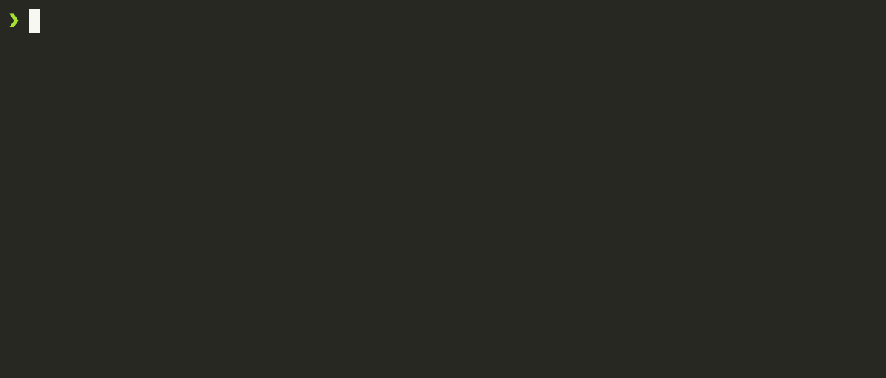
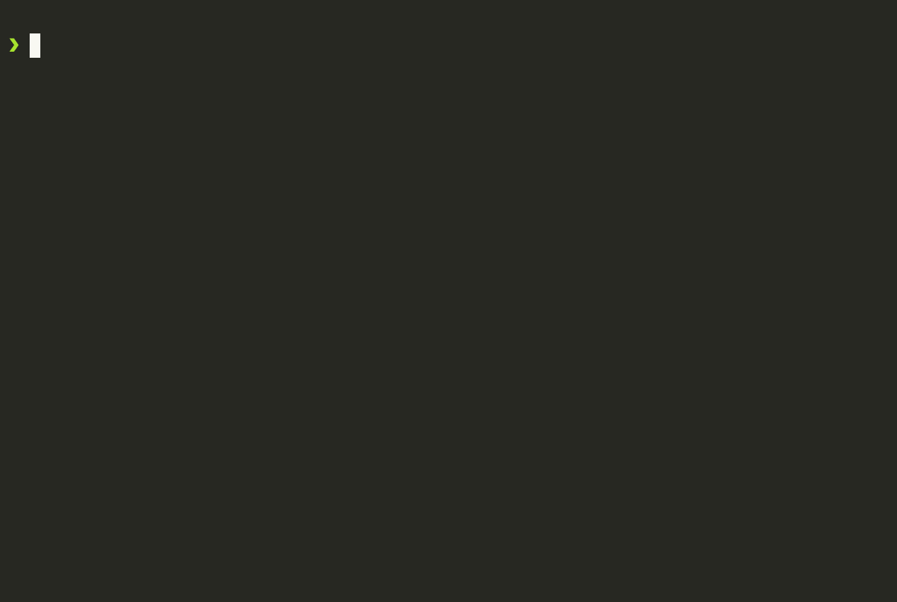
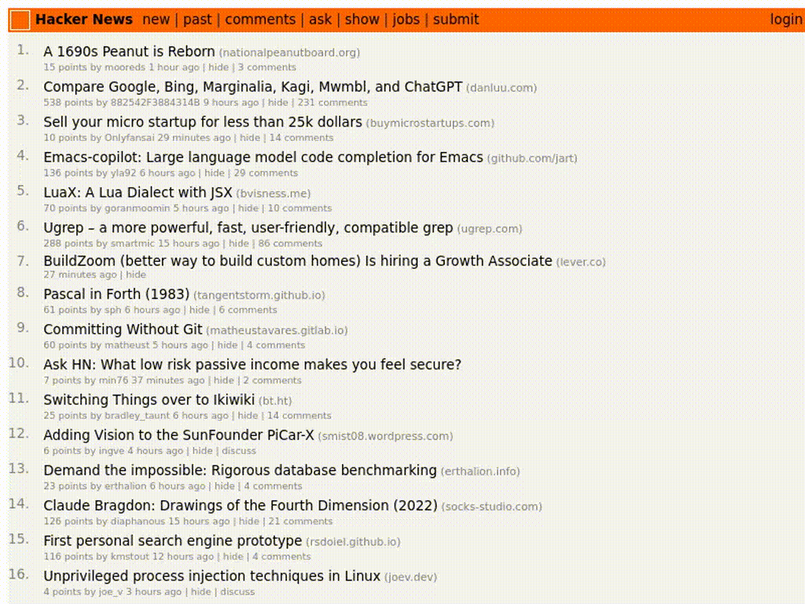

[](https://badge.fury.io/js/autobashcraft) [](https://opensource.org/licenses/MIT)  


# AutoBashCraft

AutoBashCraft (ABC) is a tool designed to automate the creation of screencasts from bash code blocks embedded in markdown files. It's ideal for educators, developers, and content creators who want to visually demonstrate bash scripts or commands with ease.

AutoBashCraft will create a docker runtime to execute the bash commands defined in the markdown file. This way you will not make persistent changes to your host system. The output of the bash commands will be captured and converted into a screencast. The screencast can then be embedded in the markdown file and can be viewed in any markdown viewer.

## Requirements

- docker

## Usage
AutoBashCraft can be easily executed with NPX to automate the creation of screencasts from bash code blocks defined in markdown files.

Run AutoBashCraft: Execute the application using NPX with the path to your markdown file.

```bash
npx autobashcraft@latest path/to/your/markdown-file.md
```

View Results: After execution, the screencasts and other outputs are stored in the "assets" directory next to the markdown file.


## Markdown Syntax

In your markdown file, use the following comment syntax to define the actions for AutoBashCraft:

### Exec (exec): Executes the bash commands written in the subsequent code block.

This tag is used for running bash commands. The content of the code block following this tag will be executed in a bash shell.

````markdown
<!--@abc: exec() -->
```bash
echo "Hello, AutoBashCraft"
```
````



### Create File (create): Creates a new file with the specified content.

Use this tag to create a new file at the specified path. The content of the code block will be written to the new file.

````markdown
<!--@abc: create({"path":"newfile.sh"}) -->
```bash
#!/bin/bash

echo "Content for the new file"

```

<!--@abc: exec() -->
```bash
cat newfile.sh
chmod +x newfile.sh
./newfile.sh
```
````



### Browse (browse): Opens a specified URL in a browser, ideal for demonstrating web-based applications.

The `browse` command is used to open the specified URL in a web browser. This is particularly useful for demonstrating applications running on a local server or for web-based interactions.

```markdown
<!--@abc: browse({"url":"https://news.ycombinator.com/"}) -->
```



## Contributing

We welcome contributions to AutoBashCraft. If you're interested in helping, please read our contributing guidelines.

## License

This project is licensed under the MIT License.