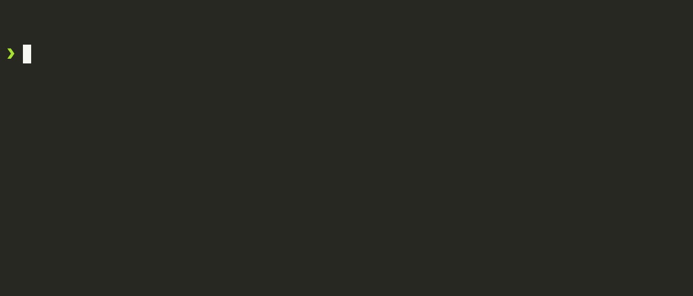

# AutoBashCraft

[](https://badge.fury.io/js/autobashcraft) [](https://opensource.org/licenses/MIT)  


AutoBashCraft (ABC) is a tool designed to automate the creation of screencasts from bash code blocks embedded in markdown files. It's ideal for educators, developers, and content creators who want to visually demonstrate bash scripts or commands with ease.

AutoBashCraft will create a docker runtime to execute the bash commands defined in the markdown file. This way you will not make persistent changes to your host system. The output of the bash commands will be captured and converted into a screencast. The screencast can then be embedded in the markdown file and can be viewed in any markdown viewer.

## Requirements

- docker
- node.js

## Usage
AutoBashCraft can be easily executed with NPX to automate the creation of screencasts from bash code blocks defined in markdown files.

Run AutoBashCraft: Execute the application using NPX with the path to your markdown file.

```bash
npx autobashcraft@latest path/to/your/markdown-file.md
```

View Results: After execution, the screencasts and other outputs are stored in the "assets" directory next to the markdown file.


## Markdown Syntax

In your markdown file, use the following comment syntax to define the actions for AutoBashCraft:

### `exec()` executes the bash commands written in the subsequent code block

This command is used for running bash commands in the terminal. The content of the code block following this tag will be executed in a bash shell.

````markdown
<!--@abc: exec() -->
```bash
echo "Hello, AutoBashCraft"
```
````


### `create({"path":string})` creates a new file with the specified content

Use this command to create a new file at the specified path. The content of the code block will be written to the new file.

````markdown
<!--@abc: create({"path":"newfile.sh"}) -->
```bash
#!/bin/bash

echo "Content for the new file"

```

<!--@abc: exec() -->
```bash
cat newfile.sh
chmod +x newfile.sh
./newfile.sh
```
````


### `browse({"url":string})` opens a specified URL in a browser

The `browse` command is used to open the specified URL in a web browser. This is particularly useful for demonstrating applications running on a local server or for web-based interactions.

```markdown
<!--@abc: browse({"url":"https://news.ycombinator.com/"}) -->
```


### `spawn({"command": string})` - Spawn a Background Process

Use the `spawn` command to start a background process inside the container runtime. This is useful for running commands that should continue executing in the background.

#### Syntax

```markdown
<!--@abc: spawn({"command": "your_background_command"}) -->
```

#### Example

````
<!--@abc: exec() -->
```bash
npx --yes degit mapcomponents/template my-mc-app
cd my-mc-app
yarn
yarn dev
```
````


The `yarn dev` process will not persist the execution of the bash markdown codeblock. To use the dev server later we need to spawn it as a background process using the `spawn` command.

```
<!--@abc: config({"basePath": "my-mc-app"}) -->
<!--@abc: spawn({"command": "yarn dev"}) -->
<!--@abc: browse({"url":"http://localhost:5173"}) -->
```


### `snapshot({"name": string})` - Save Container Runtime State

The snapshot command allows you to save the current state of the container runtime as a docker image. This image can be later used in the same or other markdown files to start a new runtime with the same state.

#### Syntax

```markdown
<!--@abc: snapshot({"name": "your_image_name"}) -->
```

#### Example

Create a textfile in the initial runtime.

<!--@abc: exec() -->
```bash
echo "Hello from runtime 1, AutoBashCraft" > testfile
cat testfile
```


Save the runtime state as "my_runtime_state_1".

`<!--@abc: snapshot({"name": "my_runtime_state_1"}) -->`
<!--@abc: snapshot({"name": "my_runtime_state_1"}) -->

Overwrite the textfile.

<!--@abc: exec() -->
```bash
echo "Hello from runtime 2, AutoBashCraft" > testfile
cat testfile
```


Save the runtime state as "my_runtime_state_2".

`<!--@abc: snapshot({"name": "my_runtime_state_2"}) -->`
<!--@abc: snapshot({"name": "my_runtime_state_2"}) -->

Load the runtime state "my_runtime_state_1".

`<!--@abc: init({"baseImage": "my_runtime_state_1"}) -->`
<!--@abc: init({"baseImage": "my_runtime_state_1"}) -->

`cat` the textfile

<!--@abc: exec() -->
```bash
cat testfile
```


Load the runtime state "my_runtime_state_2".

`<!--@abc: init({"baseImage": "my_runtime_state_2"}) -->`
<!--@abc: init({"baseImage": "my_runtime_state_2"}) -->

`cat` the textfile.

<!--@abc: exec() -->

```bash
cat testfile
```



### `init({"baseImage": string})` - Initialize a New Container Runtime

Use the init command to stop the current container runtime and initialize a new runtime using the specified or default base image. Note that containers started using a bash script will not be affected, but background processes started using spawn will have to be restarted, as init will stop and remove the current container runtime and start a new one.

#### Examples

See the **snapshot** example above.

### `config(ConfigType)` changes the configuration of AutoBashCraft

Use the `config` command in AutoBashCraft to customize its behavior. This command accepts a `ConfigType` object, allowing detailed configuration of various functionalities.

#### Usage
Insert a comment block in your markdown file with the `config` command and your desired settings:

````markdown
<!--@abc: config({"asciinema":{"speed":1.5, "rows": 5, "cols": 60 }}) -->

<!--@abc: exec() -->
```bash
echo "Hello, AutoBashCraft"
echo "Hello, AutoBashCraft"
```
````


```markdown
<!--@abc: config({
  asciinema: {
    speed: 2,
    cols: 100,
    rows: 20,
    typingPause: 0.001,
    promptPause: 1,
  },
  withDocker: false,
  debug: true,
  basePath: "your_custom_path",
}) -->
```

#### Configuration Options

- **asciinema**: Adjust screencast recordings.
  - **speed**: Playback speed.
  - **cols**: Terminal columns.
  - **rows**: Terminal rows.
  - **typingPause**: Pause after typing.
  - **promptPause**: Pause after commands.
- **withDocker**: Use Docker for command execution.
- **debug**: Enable debug mode with more verbose output.
- **basePath**: Specify a custom base path for the workspace. only relative paths without any leading "/" or "./" might work.

Once set, the configuration is persistent throughout the markdown file processing until explicitly changed.


## Ideas

[link](https://github.com/autobashcraft/cli/blob/main/docs/ideas.md)

## Contributing

We welcome contributions to AutoBashCraft.

## License

This project is licensed under the MIT License.