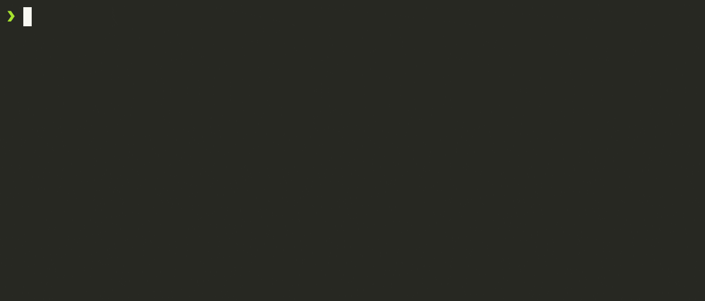

<!--@abc: exec() -->
```bash
npx --yes degit mapcomponents/template my-mc-app
cd my-mc-app
yarn
yarn dev
```

<!--@abc: config({"basePath": "my-mc-app"}) -->
<!--@abc: spawn({"command": "yarn dev"}) -->



<!--@abc: browse({"url":"http://localhost:5173"}) -->


