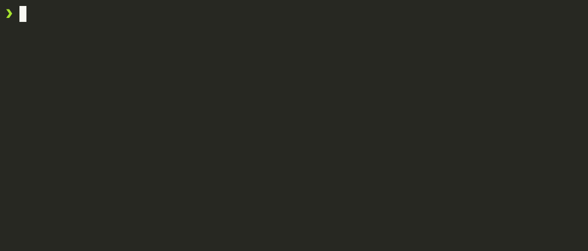

# Creating an MBTiles Tileset from GeoJSON

This guide demonstrates how to create an MBTiles tileset from a GeoJSON file.

## Download GeoJSON File

First, prepare the GeoJSON file, for this example we are going to download it using `curl`.

<!--@abc: exec() -->
```bash
curl -o sample.geojson https://raw.githubusercontent.com/georgique/world-geojson/develop/areas/new_zealand/chatham_island.json
``` 



Convert GeoJSON to MBTiles
Next, convert the GeoJSON file to an MBTiles tileset.

<!--@abc: exec() -->
```bash
git clone https://github.com/mapbox/tippecanoe.git
cd tippecanoe
make -j
sudo make install

cd ..

tippecanoe -o sample.mbtiles sample.geojson
```


# Convert the GeoJSON to MBTiles
tippecanoe -o sample.mbtiles sample.geojson
Verify the Tileset
Finally, verify the created MBTiles tileset and apply more liberal file permissions.

<!--@abc: exec() -->
```bash
chmod 666 sample.mbtiles
ls -l sample.mbtiles
```


Start a tileserver-gl service to serve the vectortiles.
We can't mount the current directory into the container since we are inside of a container.
mounting -v $(pwd):/data would mount the current working dir path from the host machine to the container.

<!--@abc: exec() -->
```bash
# create a new container and volume "tmpMbtilesVolume"
docker container create --name tmpVolumeDummyContainer -v tmpMbtilesVolume:/data ubuntu
# copy sample.mbtiles from the current dir into the continer (volume path)
docker cp sample.mbtiles tmpVolumeDummyContainer:/data/sample.mbtiles
# remove the container again, leaving the volume with our sample.mbtiles
docker rm tmpVolumeDummyContainer
# start a tileserver-gl service in background with our mbtiles volume mounted to /data
docker run --rm -v tmpMbtilesVolume:/data:rw -p 8080:8080 maptiler/tileserver-gl
```

<!--@abc: browse({"url":"http://localhost:8080/data/sample/#9.64/-43.8816/-176.5548"}) -->

