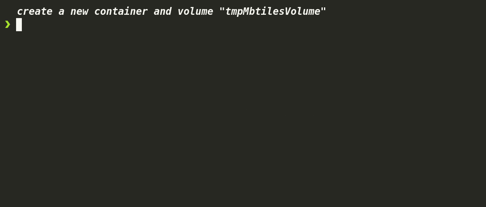

# Creating an MBTiles Tileset from GeoJSON

This guide demonstrates how to create an MBTiles tileset from a GeoJSON file.

## Download GeoJSON File

First, prepare the GeoJSON file, for this example we are going to download it using `curl`.

<!--@abc: exec() -->
```bash
curl -o sample.geojson https://raw.githubusercontent.com/georgique/world-geojson/develop/areas/new_zealand/chatham_island.json
``` 


Convert GeoJSON to MBTiles
Next, convert the GeoJSON file to an MBTiles tileset.

<!--@abc: exec() -->
```bash
git clone https://github.com/mapbox/tippecanoe.git
cd tippecanoe
make -j
sudo make install

cd ..

tippecanoe -o sample.mbtiles sample.geojson
```


# Convert the GeoJSON to MBTiles
tippecanoe -o sample.mbtiles sample.geojson
Verify the Tileset
Finally, verify the created MBTiles tileset.

<!--@abc: exec() -->
```bash
ls -l sample.mbtiles

sqlite3 sample.mbtiles "SELECT * FROM metadata;"

```



<!--@abc: browse({"url":"http://localhost:8080/", "service_command":"docker run -d --rm -v $(pwd):/data -p 8080:8080 maptiler/tileserver-gl"}) -->