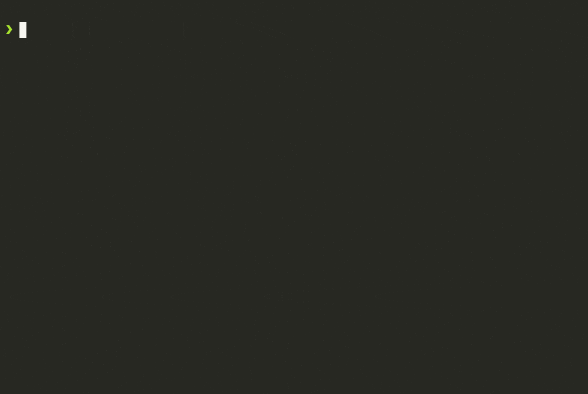

<!--@abc: exec() -->
```bash
npx -y degit mapcomponents/template your-app-name
cd your-app-name
ls -al
yarn
yarn dev
```


Now visit http://localhost:5173 to view your app in the browser.


<!--@abc: browse({"url":"http://localhost:5173", "service_command": "cd /app/your-app-name && yarn dev"}) -->


<!--@abc: create({"path":"your-app-name/src/testfile.ts"}) -->
```typescript
export const testfile = {};
```

<!--@abc: update({"path":"src/testfile.ts"}) -->
```typescript
export const testfile_w = {};
```